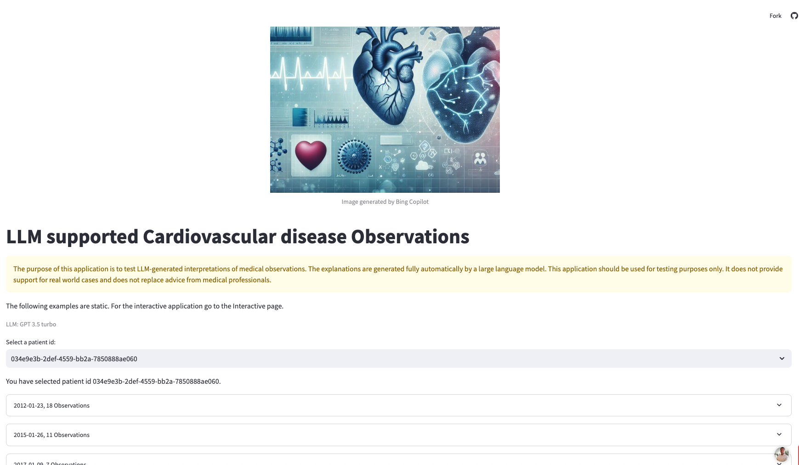

# UOC - TFG Repositorio oficial del proyecto final 2024-2025

Este repositorio está compuesto por los siguientes elementos:

- Main Notebook: /notebook
- Classic WebApplication on Flask: /flaskapp
- Streamlitt LLM WebApp: /webapp

## Instalación de las dependencias

1. Instalar Docker Debian + Terraform

Para poder instalar el contenedor docker y las dependencias de Terraform haríamos

```
$ docker run -p 8000:8000 --name debian -f docker/Dockerfile_debian 
```

2. Instalar Docker JupyterLab + MLFlow

La instalación del contenedor de JupyterLab y el servidor MLflow utilizamores `docker-compose`

```
$ docker-compose run -f docker/docker-compose.yml
```

3.  Ejecutar la Web Application Streamlit-LLM

## Entendiendo las observaciones médicas con LLM

El propósito de esta aplicación es probar interpretaciones generadas por modelos de lenguaje extenso (LLM) sobre observaciones médicas.
Las explicaciones son generadas de forma completamente automática por un modelo de lenguaje extenso.
Esta aplicación debe usarse solo con fines experimentales.
No proporciona soporte para casos del mundo real y no reemplaza el consejo de profesionales médicos.

https://demo-heart-disease-prediction-llm.streamlit.app/

**IMPORTANTE**
En caso de error del link, clicar en ejecutar `backup` y esperar un par de minutos para poder volver a cargar la página.

## Interacción con el chatbot

Este chatbot proporcionará respuestas rápidas a las preguntas frecuentes mediante la configuración de chatbots de palabras clave basados ​​en reglas
con lógica `if/else`. Este chatbot utilizará una serie de reglas bien definidas para guiar a los clientes a través de una serie de opciones
de menú que pueden ayudar a responder sus preguntas.

Estará disponible para los clientes las 24 horas del día, los 7 días de la semana en sus canales preferidos y, al mismo tiempo,
gestionará más consultas a la vez.

### Architecture

#### LangChain RAG Architecture

La calidad de los sistemas RAG depende de la relevancia y la calidad de los documentos recuperados.
Afortunadamente, se puede emplear un conjunto emergente de técnicas para diseñar y mejorar los sistemas RAG.
Nos hemos centrado en la taxonomía y el resumen de muchas de estas técnicas (consulte la figura siguiente) y 
compartiremos algunas pautas estratégicas de alto nivel en las siguientes secciones. 
Puede y debe experimentar con el uso de diferentes piezas juntas. 
También puede encontrar útil esta guía de LangSmith para mostrar cómo evaluar diferentes iteraciones de su aplicación.


#### Multiagent Workflow

Cuando hablamos de “multiagente”, hablamos de múltiples actores independientes impulsados ​​por modelos de lenguaje conectados de una manera específica.


* Streamlit almacena en caché datos médicos sintéticos cargados de Synthea.
* Creación de indicaciones con LangChain PromptTemplate.
* Modelo de lenguaje servido por el backend de Clarifai.

### Cómo ejecutar la aplicación

```
cd webapp
conda install -name python310 python=3.10
conda activate python310
pip install -r requirements.txt
streamlit run main.py
```

La captura de la web application


### Fuente de datos elaborada por:

https://synthetichealth.github.io

## Discusión

* Considerar los cambios de valores a lo largo del tiempo en lugar de interpretar cada punto temporal individualmente.
* Interpretar mediciones con contexto (edad, género).
* Considerar diferentes criterios de diagnóstico nacionales.
* Preservar la privacidad al interactuar con los LLM.
* Analizar la salida del LLM y procesar para consultas adicionales.
* Etiquetas de advertencia según la relevancia clínica de los resultados.
* Salvaguardas para guiar la entrada del usuario.

### Técnicas de Prompt engineering

* Mejores indicaciones = mejores resultados con LLM https://learnprompting.org/docs/basics/prompt_engineering#what-happens-when-a-prompt-doesnt-work
* Indicaciones de instrucción https://learnprompting.org/docs/basics/instructions
* Asignación de roles https://learnprompting.org/docs/basics/roles
* Indicaciones de pocos ejemplos (Few-shot) vs indicaciones de instrucción https://learnprompting.org/docs/basics/few_shot#more-on-structure
* Cadena de pensamientos (CoT - Chain-of-Thought) https://learnprompting.org/docs/intermediate/chain_of_thought
* Ensembling
    * AMA (Ask Me Anything) https://learnprompting.org/docs/reliability/ensembling#ask-me-anything-ama-prompting
    * Verificador diverso en pasos de razonamiento https://learnprompting.org/docs/reliability/ensembling#diverse
* Calibración https://learnprompting.org/docs/reliability/calibration

### Problem: Alucinaciones

> Frecuencia respiratoria: Este es el número de respiraciones que una persona toma por minuto. Una frecuencia respiratoria normal para un adulto en reposo está entre 12 y 20 respiraciones por minuto. En este caso, la frecuencia respiratoria del paciente es de 14 respiraciones por minuto, lo que es ligeramente superior a lo normal.

> Entrada: Amplitud de distribución de eritrocitos [Volumen entítico] por recuento automatizado, Amplitud de distribución de plaquetas [Volumen entítico] en sangre por recuento automatizado

[...]

> Salida: Entonces, en términos simples, estas observaciones nos dicen que los glóbulos rojos en la sangre de este paciente están distribuidos en un rango bastante amplio de tamaños, y la máquina que los contó obtuvo una medición ligeramente más alta que el recuento manual.

## Streamlit resources

* https://streamlit.io/community/llm-hackathon-2023
* https://discuss.streamlit.io/t/streamlit-llm-hackathon/50618

## Learning resources

* LLM
    * https://aiplanet.com/learn/llm-bootcamp
* Prompting
    * https://langchain.readthedocs.io/en/latest/
    * https://learnprompting.org/
    * https://apps.cognitiveclass.ai/learning/course/course-v1:IBMSkillsNetwork+AI0117EN+v1
* Monitoring
    * https://github.com/whylabs/langkit
    * https://arize.com/llm/

Based by the repositories:

- https://www.kaggle.com/code/amlanmohanty1/build-web-app-for-heart-disease-with-streamlit#Import-streamlit,pyngrok,-and-ngrok-modules
- https://github.com/bsenst/streamlit-llm
- 